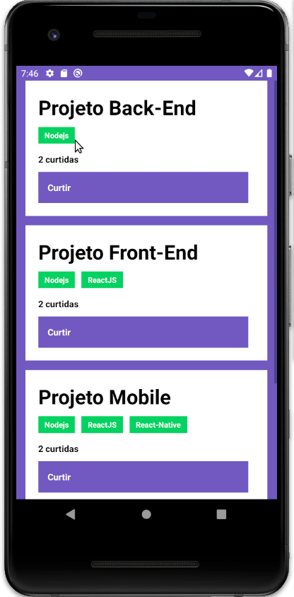

<p align="center">
  
</p>
<h3 align="center"> Desafio 4 - do React Native </h3>  
<p>  
<p> 
<p align="center">
  
</p>  
<p>  
<p>  

## :rocket: Sobre:  
Neste desafio é proposto continuar a aplicação que iniciamos no [**desafio 2**](https://github.com/muriloportugal/bootcamp11-desafio2-conceitos-node.js) e [**desafio 3**](https://github.com/muriloportugal/bootcamp11-desafio3-conceitos-reactJS) desenvolvendo um aplicativo mobile com **React Native** para listar os repositórios e com opção de curtir cada repositório.

Com este desafio percebemos podemos perceber como o **React Native** é uma grande ferramenta para desenvolvimento mobile, pois com praticamente o mesmo código conseguimos desenvolver aplicativos para **iOS** e **Android**, poupando muitas horas de desenvolvimento e curva de aprendizado de novas linguagens.

[Detalhes do desafio](https://github.com/Rocketseat/bootcamp-gostack-desafios/tree/master/desafio-conceitos-react-native)  

## :checkered_flag: Como testar:  
:warning: **IMPORTANTE:**  
Por se tratar de uma continuação do [**desafio 2**](https://github.com/muriloportugal/bootcamp11-desafio2-conceitos-node.js) é necessário que este esteja rodando em seu computador para que ao executar este desafio o front-end consiga se conectar no back-end criado no [**desafio 2**](https://github.com/muriloportugal/bootcamp11-desafio2-conceitos-node.js), acesse o [repositório](https://github.com/muriloportugal/bootcamp11-desafio2-conceitos-node.js) para ver como clonar e roda-lo em seu computado.  

Neste projeto foi utilizado o yarn, então caso ainda não tenha, siga este [guia parar instalação](https://classic.yarnpkg.com/en/docs/install) do mesmo.  
Faça o download ou o clone deste repositório para o seu computador.  
```bash
git clone https://github.com/muriloportugal/bootcamp11-desafio4-conceitos-react-native.git
```
Entre na pasta "bootcamp11-desafio4-conceitos-react-native" e rode o comando abaixo para que sejam instaladas as dependências:
```bash
yarn 
```
Depois de instalar as dependências, certifique-se que o back-end criado no desafio 2 esteja executando conforme mencionado acima.  

Agora para rodar o aplicativo será necessário utilizar o emulador do **Android** / **iOS**, ou rodar direto no celular, caso precise de ajuda para instalar ou configura-los pode consultar esse [site]() que tem um passo a passo bem detalhado.

:warning: **IMPORTANTE:**  
Altere o arquivo ["src/services/api.js"](./src/services/api.js) alterando o "localhost" conforme sua necessidade.  

Agora com tudo configurado podemos iniciar o Metro, responsável por pegar nosso código e criar o bundler.js.
Execute o comando abaixo na pasta raiz do projeto.

```bash
yarn react-native start
```

Agora, com o Metro executando, seu emulador rodando ou o celular conectado no computador podemos executar o comando abaixo para que o aplicativo seja instalado e executado.
## Android
```bash
yarn react-native run-android
```
## iOS
```bash
yarn react-native run-ios
```
---
## :robot: Tecnologias  

- [Node.js](https://nodejs.org/en/) 
- [ReactJS](https://pt-br.reactjs.org/docs/add-react-to-a-website.html) 
- [React-Native](https://reactnative.dev/)

---
## :memo: Licença

Esse projeto está sob a licença MIT. Veja o arquivo [LICENSE](./LICENSE) para mais detalhes.